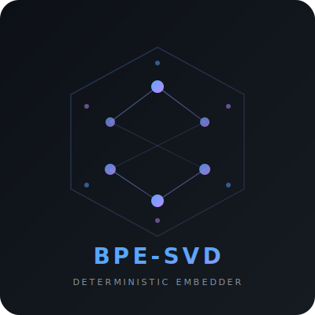

# BPE-SVD Embedder Demo

**Interactive demo of the deterministic BPE-SVD embedding pipeline.**

This is a standalone showcase — it runs in its own virtual environment,
isolated from the parent project. No GPU, no API keys, no model server.

<p align="center">
  
</p>

---

## What This Demonstrates

The BPE-SVD embedder converts text into semantic vectors using pure math
instead of a neural network. This demo lets you step through every stage
of the pipeline interactively:

| Step | Operation | What You See |
|------|-----------|-------------|
| 1 | **Tokenize** | Raw text → BPE subword tokens |
| 2 | **Chunk** | Tokens split into budget-bounded hunks |
| 3 | **Embed** | Each hunk → dense vector (with heatmap visualisation) |
| 4 | **Reverse** | Each vector → nearest tokens by cosine similarity |

All results stay on screen until you explicitly clear them or re-run.

---

## Quick Start

### 1. Install

```bash
# Windows
install.bat

# macOS / Linux
chmod +x install.sh && ./install.sh
```

This creates an isolated `.venv` inside `_showcase/` — your system Python
and the parent project's environment are untouched.

### 2. Run the GUI

```bash
# Windows
run_ui.bat

# macOS / Linux
./run_ui.sh
```

A splash screen with the BPE-SVD logo appears briefly, then the main
window opens with a dark-themed interface.

### 3. Run the CLI

```bash
# Windows
run_cli.bat tokenize "the king wore a golden crown"
run_cli.bat chunk "the king wore a golden crown" --budget 5
run_cli.bat embed "the king wore a golden crown" --budget 5
run_cli.bat reverse "the king wore a golden crown" --budget 5 --top-k 3
run_cli.bat pipeline "the king wore a golden crown" --budget 5

# macOS / Linux
./run_cli.sh tokenize "the king wore a golden crown"
./run_cli.sh pipeline "the king wore a golden crown" --budget 5
```

---

## CLI Commands

| Command | Description | Example |
|---------|-------------|---------|
| `tokenize` | Text → BPE tokens | `tokenize "hello world"` |
| `chunk` | Text → budget-bounded hunks | `chunk "hello world" --budget 5` |
| `embed` | Text → hunks → vectors | `embed "hello world" --budget 5` |
| `reverse` | Vectors → nearest tokens | `reverse "hello world" --top-k 3` |
| `pipeline` | All steps end-to-end | `pipeline "hello world" --budget 5` |

**Flags:**
- `--budget N` — max tokens per hunk (default: 10)
- `--top-k N` — nearest tokens to show per vector (default: 5)
- `--json` — also print machine-readable JSON output

---

## GUI Overview

```
┌──────────────────────────────────────────────────────────────┐
│  BPE-SVD   [Tokenize] [Chunk] [Embed] [Reverse]     [Clear] │
├────────────────────┬─────────────────────────────────────────┤
│                    │                                         │
│  Input Text        │  Results                                │
│  ┌──────────────┐  │  ┌─ Tokenize ─────────────────────┐    │
│  │ Enter your   │  │  │ tokens: [the] [king] [</w>]... │    │
│  │ text here... │  │  └────────────────────────────────┘    │
│  │              │  │  ┌─ Chunk (budget=5) ──────────────┐   │
│  └──────────────┘  │  │ Hunk 0: [the] [king] [wore]    │    │
│                    │  │ Hunk 1: [a] [golden] [crown]    │    │
│  Token Budget      │  └────────────────────────────────┘    │
│  [    10    ]      │  ┌─ Embed ─────────────────────────┐   │
│                    │  │ Hunk 0 → 300d ████████████████  │    │
│  [Run Full Pipeline] │ │ Hunk 1 → 300d ██████████████    │    │
│                    │  └────────────────────────────────┘    │
│                    │  ┌─ Reverse ───────────────────────┐   │
│                    │  │ Hunk 0: king cos=+0.89          │    │
│                    │  │         crown cos=+0.73         │    │
│                    │  └────────────────────────────────┘    │
├────────────────────┴─────────────────────────────────────────┤
│  Ready                                                       │
└──────────────────────────────────────────────────────────────┘
```

- **Left panel**: Text input + token budget control + "Run Full Pipeline" button
- **Right panel**: Scrollable results area — cards accumulate as you run steps
- **Toolbar**: Individual step buttons + Clear
- **Status bar**: Current operation feedback

---

## Project Structure

```
_showcase/
├── README.md              ← you are here
├── install.bat / .sh      ← creates isolated .venv
├── run_ui.bat / .sh       ← launches graphical demo
├── run_cli.bat / .sh      ← launches CLI demo
├── requirements.txt       ← numpy (only dependency)
├── assets/
│   └── logo.svg           ← BPE-SVD logo
└── embedder_demo/
    ├── __init__.py
    ├── __main__.py         ← python -m embedder_demo entry
    ├── core.py             ← interface stubs (swap point for real embedder)
    ├── ui.py               ← tkinter GUI with splash screen
    └── cli.py              ← argparse CLI with coloured output
```

### Wiring the Real Embedder

When ready to connect the actual BPE-SVD engine, only `core.py` changes.
The four public functions (`tokenize`, `chunk`, `embed_hunk`, `reverse_vector`)
and their return types define the contract — the UI and CLI consume those
shapes and never import from the parent project directly.

---

## Requirements

- Python 3.11+
- tkinter (included with standard Python on Windows; may need
  `python3-tk` on Linux)
- numpy (installed automatically by the install script)

No GPU. No model server. No API keys. No internet connection required.

---

## About the BPE-SVD Embedder

For the full technical details:
- [Project README](../README.md) — practical overview for developers
- [Mathematical Foundations](../docs/BPE_SVD_WHITEPAPER.md) — formal derivation of the pipeline

*Part of the [Graph Manifold](../README.md) project.*
